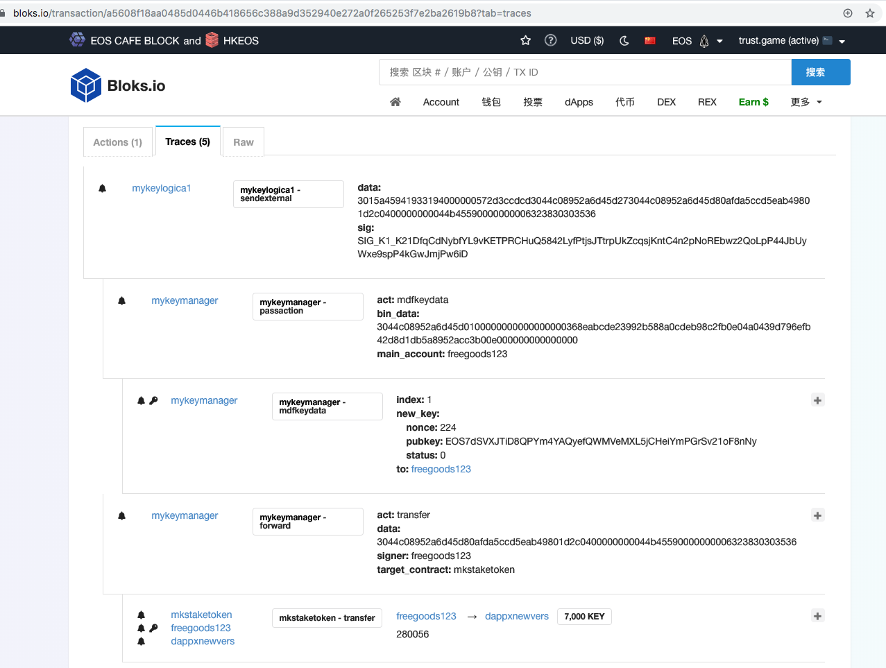
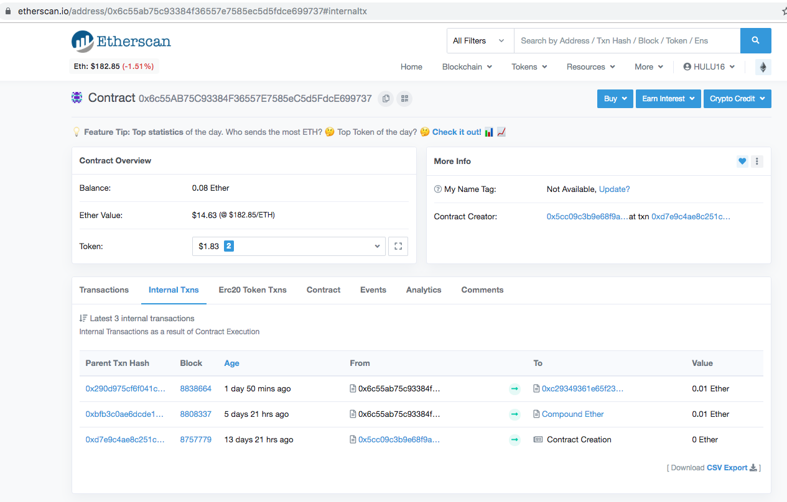

# 通过浏览器和代码查看MYKEY合约交易


## 简介

MYKEY账户是合约账户，用户的交易通过MYKEY服务端Postman账户（携带用户签名）上链。
在区块链浏览器上，用户交易会表现为内部交易，显示在交易详情中。
下面会介绍如何查看MYKEY交易内容。

**注意:** [MYKEY的账号体系](https://github.com/mykeylab/Documentation/blob/master/English/MYKEY%20on%20EOSIO.md#mykey-account-structure)与其他的EOS账号的差异


## 从浏览器中查看MYKEY交易

#### EOS链
MYKEY账户转账KEY代币[示例交易](https://bloks.io/transaction/a5608f18aa0485d0446b418656c388a9d352940e272a0f265253f7e2ba2619b8?tab=traces)

通过交易的Traces页面可以看到内部交易，用户freegoods123向dappxnewvers转账7000KEY。 



#### Ethereum链
MYKEY账户转账ETH[示例交易](https://etherscan.io/tx/0x290d975cf6f041c3dafdee984ea45783ae135050065d144657fa2358e0d8368f)

通过[Internal Txs](https://etherscan.io/address/0xc29349361e65f23f5d917a1b5922c03727dedb64#internaltx)页面可以看到内部交易，用户0x6c55ab75c93384f36557e7585ec5d5fdce699737向0xc29349361e65f23f5d917a1b5922c03727dedb64转账0.01 ETH。



### 通过代码查看MYKEY交易

EOS交易示例代码
https://github.com/mykeylab/mykey-tx-tool/blob/master/ViewEosTx.js
```
➜  mykey-tx-tool git:(master) node ViewEosTx.js
action_traces
    mykeylogica1::sendexternal,{"data":"3015a45941933194000000572d3ccdcd3044c08952a6d45d273044c08952a6d45d80afda5ccd5eab49801d2c040
       mykeymanager::passaction,{"act":"mdfkeydata","bin_data":"3044c08952a6d45d0100000000000000000368eabcde23992b588a0cdeb98c2fb0e0
          mykeymanager::mdfkeydata,{"index":1,"new_key":{"nonce":224,"pubkey":"EOS7dSVXJTiD8QPYm4YAQyefQWMVeMXL5jCHeiYmPGrSv21oF8nNy","
       mykeymanager::forward,{"act":"transfer","data":"3044c08952a6d45d80afda5ccd5eab49801d2c0400000000044b4559000000000632383030
          mkstaketoken::transfer,{"from":"freegoods123","memo":"280056","quantity":"7000.0000 KEY","to":"dappxnewvers"}
          mkstaketoken::transfer,{"from":"freegoods123","memo":"280056","quantity":"7000.0000 KEY","to":"dappxnewvers"}
          mkstaketoken::transfer,{"from":"freegoods123","memo":"280056","quantity":"7000.0000 KEY","to":"dappxnewvers"}

```


ETH交易示例代码
https://github.com/mykeylab/mykey-tx-tool/blob/master/ViewEthTx.js
```
➜  mykey-tx-tool git:(master) ✗ node ViewEthTx.js
tx 0x290d975cf6f041c3dafdee984ea45783ae135050065d144657fa2358e0d8368f
from:  0x6c55AB75C93384F36557E7585eC5d5FdcE699737
to:  0xC29349361e65f23F5d917A1B5922C03727deDB64
token: eth
amount:  0.01

tx 0xc0d445a1dbe4a59ca78a94a529c0212eeec8b8396ed92ab9b3b245225040d34e
from:  0x6c55AB75C93384F36557E7585eC5d5FdcE699737
to:  0xC29349361e65f23F5d917A1B5922C03727deDB64
token:  0x1914caA9F41468CCDFaA8fc72294A4A51a3bB379
amount:  10
```


